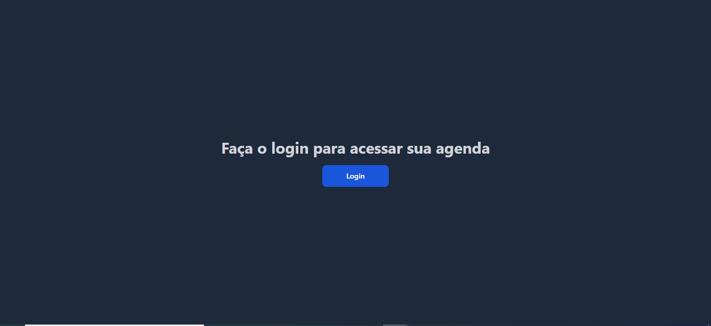
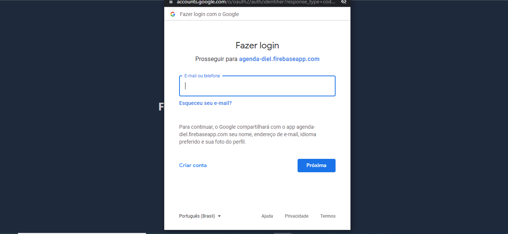

# Introdução

 Agenda de tarefas diaria utilizando next.js e firebase.
 A agenda contará com um sistema de login utilizando o email do google.

# Como iniciar o projeto

 baixe o projeto,
 baixe as dependencias,
 Crie uma conta na firebase e inicie um novo projeto,
 crie um novo banco fireStore com as autorizações de escrita no banco ativada,
 crie o arquivo .env com os dados de configuração da firebase. 

# Tecnologias

React
Next.js
tailwind
Typescript 
FlowBite
HeadlessUI
FullCalendar
Moment
Firebase

# Casos de uso

- Login com o email do google

- Adicionar tarefa

- Editar tarefa

- Buscar tarefa.

